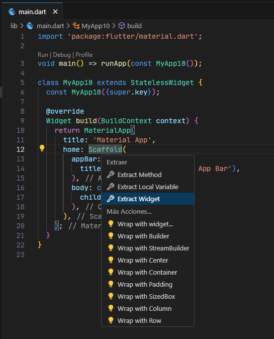
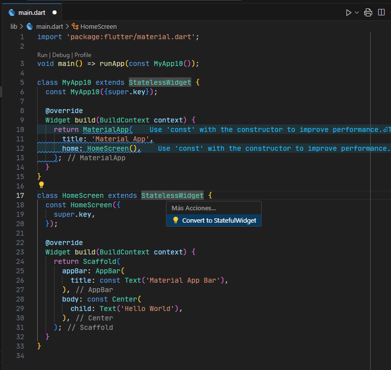
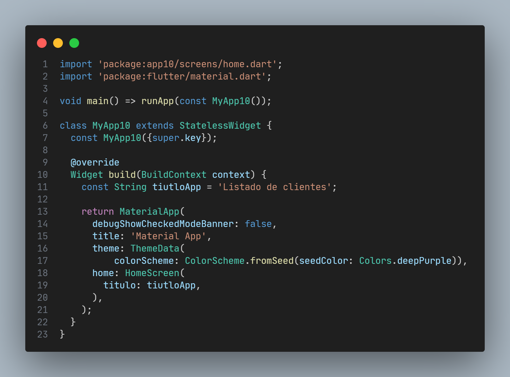

# app10

Un nuevo proyecto de Flutter.

## Empezando

Este proyecto es un punto de partida para una aplicación Flutter.

Algunos recursos para ayudarte a comenzar si este es tu primer proyecto de Flutter:

- [Lab: Write your first Flutter app](https://docs.flutter.dev/get-started/codelab)
- [Cookbook: Useful Flutter samples](https://docs.flutter.dev/cookbook)

Para obtener ayuda para comenzar con el desarrollo de Flutter, consulte la
[online documentation](https://docs.flutter.dev/), que ofrece tutoriales,
ejemplos, orientación sobre desarrollo móvil y una referencia API completa.

## Vista previa de la app10 - Consumir una API desde Supabase

## Código de la primera pantalla

## Crear una carpeta models y construir la clase Cliente

## Instalar la dependecia de supabase_flutter

Para instalar la dependencia visite la siguiente URL:

- [ https://pub.dev/ ](https://pub.dev/)

## Rediseñar el método main() para usar la dependecia de supabase_flutter

## Extraer el cliente Supabase en una variable para usos posteriores

## Crear una propiedad de tipo future y un método que retorne un future

## Traer el método initState() y llamar el método obtenerClientes().
### Asignar a el future listaClientes el método obtenerClientes() en el initState().

### En la propiedad body del HomeScreen crear el widget FutureBuilder.
### Crer un método verClientes() que va a retornar una lista de widgets.

### Agregar a la lista de widgets clientes un Card() con un hijo ListTile() que se va retornar.

### Agregar las propiedades leading y trailing al ListTile().
### Construimos el CircleAvartar().

